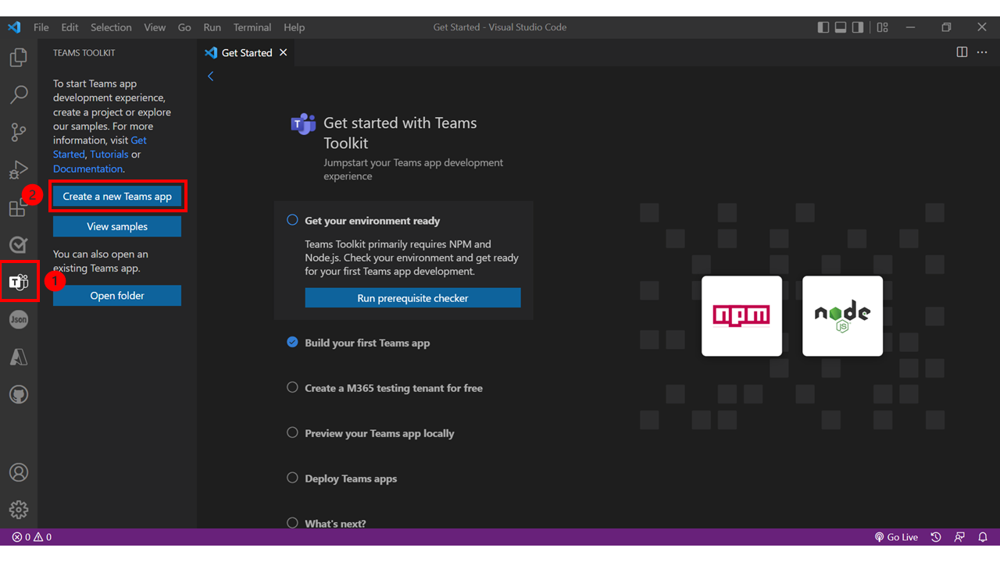
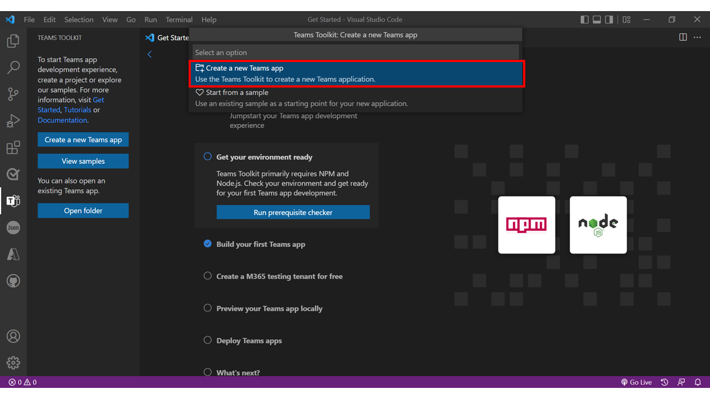
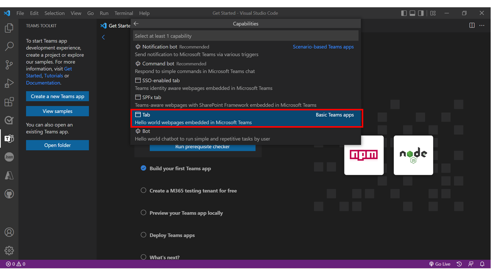
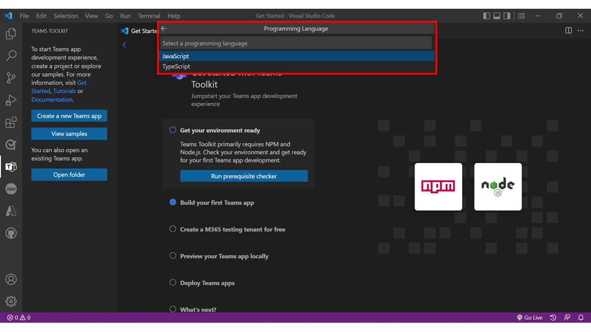
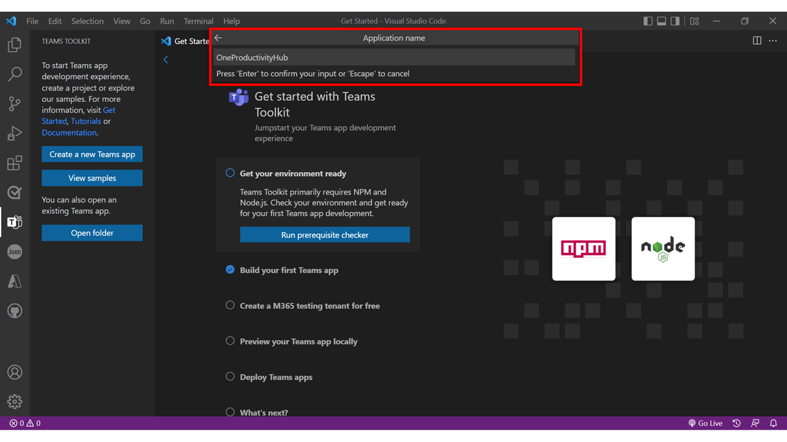
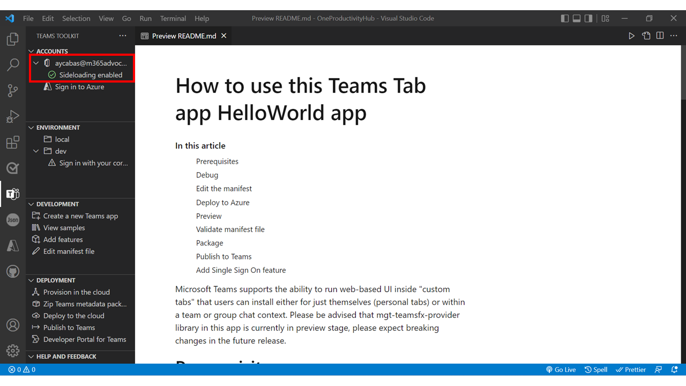
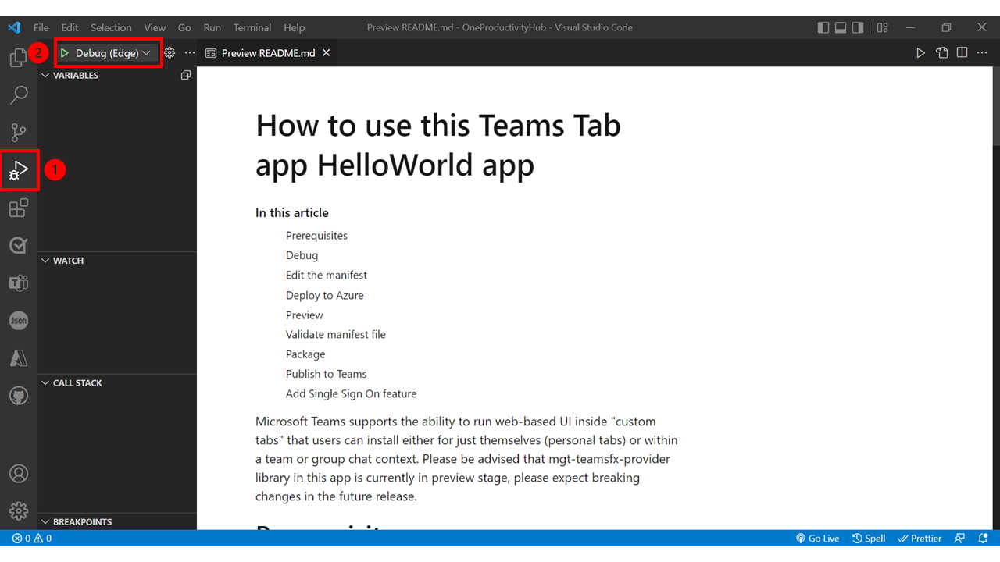
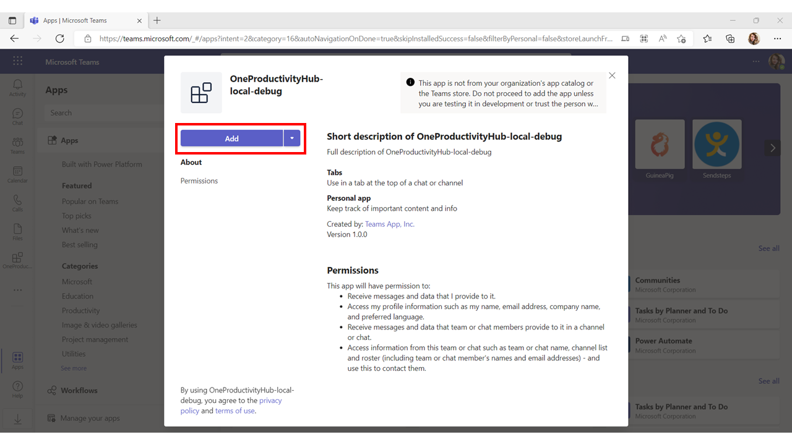
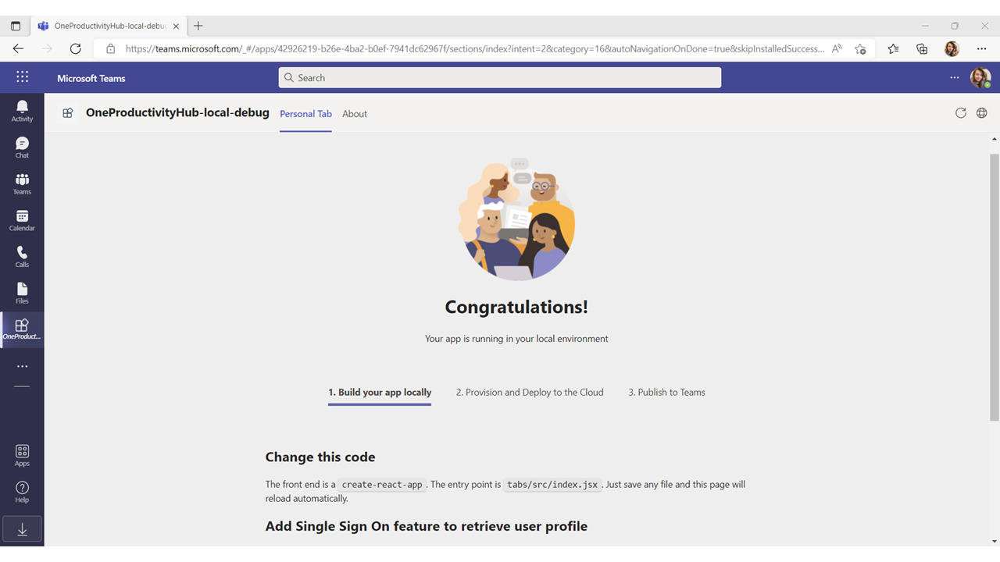

## Part 1 - Create a new Teams tab

- [Part 0 - Environment Setup](00-Setup.md) 
- [Part 1 - Create a new Teams tab](01-Create_Teams_tab.md) ( **📍 You are here** )
- [Part 2 - Add Single Sign On feature in your tab](/Labs/02-Create_SSO_Feature.md)
- [Part 3 - Add Microsoft Graph Toolkit TeamsFX Provider and build consent permissions feature](/Labs/03-Initialize_MGT_and_consent_permissions.md)
- [Part 4 - Design your One Productivity Hub using by Microsoft Graph Toolkit components](04-Design_your_tab_using_MGT_components.md)
- [Part 5 - Test One Productivity Hub app on Microsoft Teams](05-Test_your_tab.md)

---
**📌 NOTE 📌 :** Make sure to complete the setup for Microsoft Teams Toolkit.

---
1. Launch Visual Studio Code and select Microsoft Teams icon on the left side bar, then select **Create a new Teams app**.
   
   
1. Select **Create a new Teams app** and press **Enter**.
   

1. Select **Tab** and press **Enter**.
   
   
1. Select **JavaScript** and press **Enter**.
    

1. Select a folder to save your application and give an application name as **OneProductivityHub**, press **Enter**.
    
    
1. Once your application is created, select **Teams Toolkit** tab on the left side bar, go to **Accounts** section and sign in with your Microsoft 365 Developer Tenant.
    

1. Select **Run and Debug** tab in the left side bar and select **Debug** icon to run the app.
    

1. Once Microsoft Teams is launched in your selected browser, select **Add** to display your app on Microsoft Teams.
    

1. Teams Toolkit will run the tab in your Microsoft 365 Developer Tenant account.
    

## References
- Microsoft Docs - [Build apps with the Microsoft Teams Toolkit and Visual Studio Code](https://cda.ms/1Jj)
- Visual Studio Marketplace - [Microsoft Teams Toolkit Extension for Visual Studio Code](https://marketplace.visualstudio.com/items?itemName=TeamsDevApp.ms-teams-vscode-extension)

## Next Step
> ▶️ **[Part 2 - Add Single Sign On feature in your tab](/Labs/02-Create_SSO_Feature.md)**
