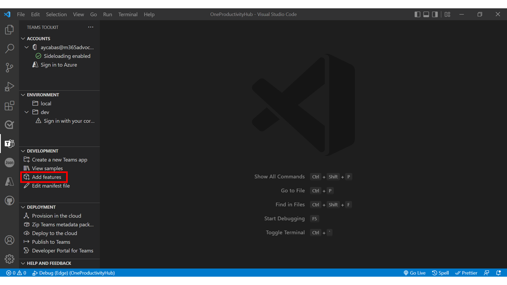
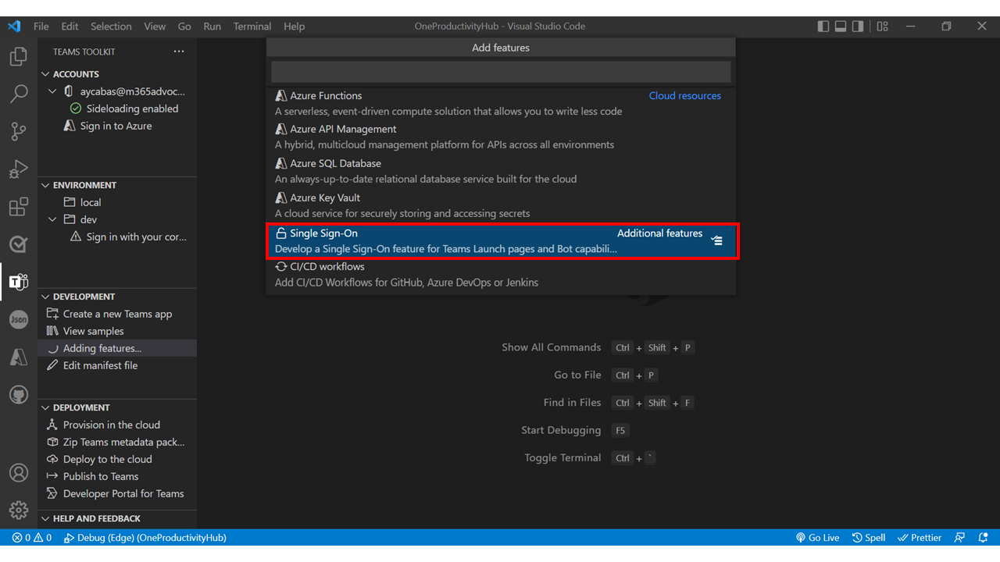
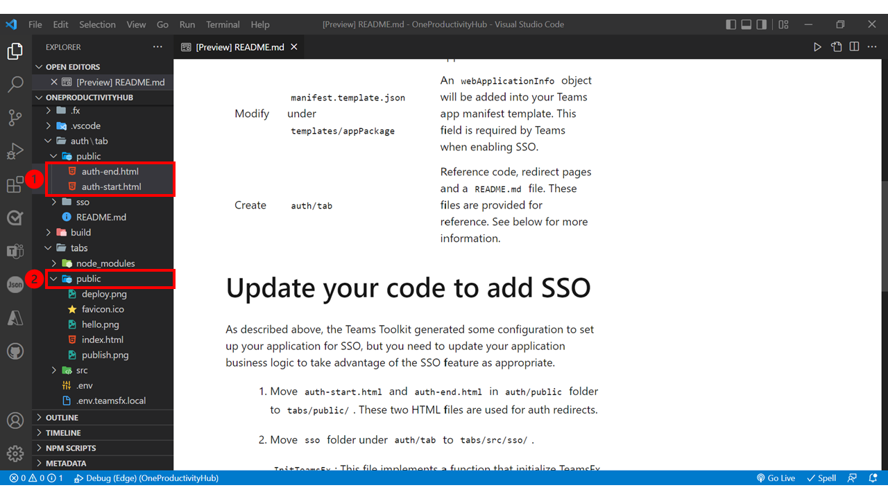

## Part 2 - Add Single Sign On feature in your tab

- [Part 0 - Environment Setup](00-Setup.md) 
- [Part 1 - Create a new Teams tab](01-Create_Teams_tab.md) 
- [Part 2 - Add Single Sign On feature in your tab](/Labs/02-Create_SSO_Feature.md) ( **📍 You are here** )
- [Part 3 - Add Microsoft Graph Toolkit TeamsFX Provider and build consent permissions feature](/Labs/03-Initialize_MGT_and_consent_permissions.md)
- [Part 4 - Design your One Productivity Hub using by Microsoft Graph Toolkit components](04-Design_your_tab_using_MGT_components.md)
- [Part 5 - Test One Productivity Hub app on Microsoft Teams](05-Test_your_tab.md)

1. Select **Teams Toolkit** icon on the left side menu and select **Add features** under the **DEVELOPMENT** section.
   

1. Scroll down in the features list and select **Single Sign On**.
   

1. Move `auth-start.html` and `auth-end.html` in **auth/public** folder to **tabs/public/** in your project. These two HTML files are used for auth redirects.
   

## References
- Microsoft Docs - [Add single sign-on to Teams app](https://docs.microsoft.com/en-us/microsoftteams/platform/toolkit/add-single-sign-on?tabs=typescript)

## Next Step
> ▶️ **[Part 3 - Add Microsoft Graph Toolkit TeamsFX Provider and build consent permissions feature](/Labs/03-Initialize_MGT_and_consent_permissions.md)**
