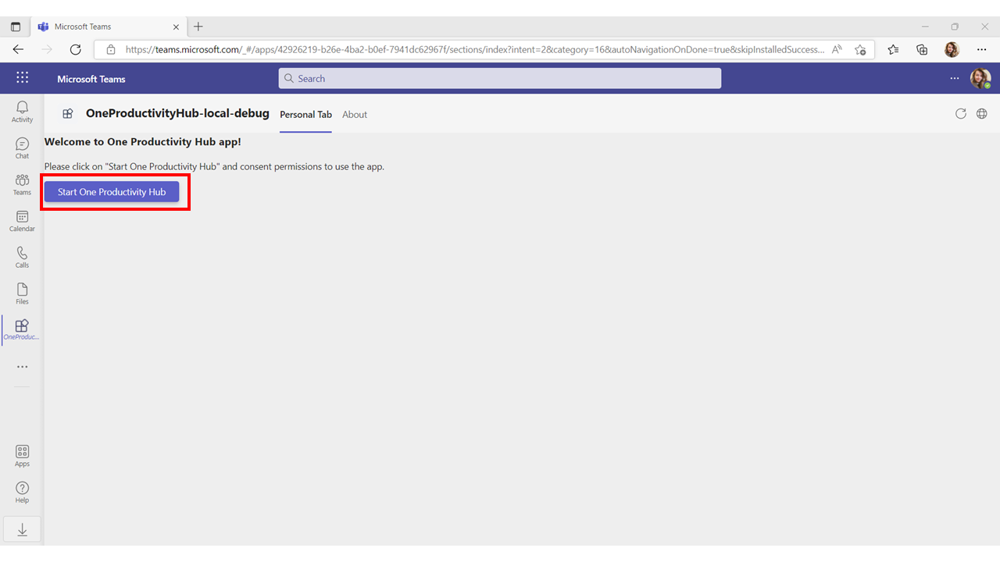
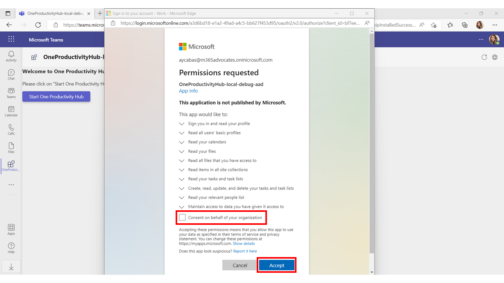

## Part 3 - Add Microsoft Graph Toolkit TeamsFX Provider and build consent permissions feature

- [Part 0 - Environment Setup](00-Setup.md) 
- [Part 1 - Create a new Teams tab](01-Create_Teams_tab.md) 
- [Part 2 - Add Single Sign On feature in your tab](/Labs/02-Create_SSO_Feature.md)
- [Part 3 - Add Microsoft Graph Toolkit TeamsFX Provider and build consent permissions feature](/Labs/03-Initialize_MGT_and_consent_permissions.md) ( **📍 You are here** )
- [Part 4 - Design your One Productivity Hub using by Microsoft Graph Toolkit components](04-Design_your_tab_using_MGT_components.md)
- [Part 5 - Test One Productivity Hub app on Microsoft Teams](05-Test_your_tab.md)

We are back to our project on Visual Studio Code.

### Add the Microsoft Graph Toolkit

To use Microsoft Graph Toolkit and the Teams SDK via the loaders, open **Terminal** by clicking ``Ctrl + Shift + ` `` install the following packages in your app:

```powershell
npm install @microsoft/mgt-element @microsoft/mgt @microsoft/mgt-react @microsoft/mgt-teamsfx-provider
```

### Initialize the TeamsFX Provider

Go to **tabs/src/components**, open `Tabs.jsx`, remove all the code inside the page and add below code snippets:

1. Add the following imports on top of the page:
    
    ```javascript
    import React from 'react';
    import './App.css';
    import { TeamsFx } from "@microsoft/teamsfx";
    import { Button } from "@fluentui/react-northstar"
    import { Providers, ProviderState } from '@microsoft/mgt-element';
    import { TeamsFxProvider } from '@microsoft/mgt-teamsfx-provider';
    import { CacheService } from '@microsoft/mgt';
    ```

1. Add below class to initialize **TeamsFX Provider** and define the required permissions inside the **Scope**:

    ```javascript
    class Tab extends React.Component {
    
    
      async componentDidMount() {
    
        /*Define scope for the required permissions*/
        this.scope = [
          "User.Read",
          "User.ReadBasic.All",
          "Calendars.Read",
          "Files.Read",
          "Files.Read.All",
          "Sites.Read.All",
          "Tasks.Read",
          "Tasks.ReadWrite",
          "People.Read",
          "User.ReadBasic.All"
        ];
    
        /*Initialize TeamsFX provider*/
        this.teamsfx = new TeamsFx();
        const provider = new TeamsFxProvider(this.teamsfx, this.scope)
        Providers.globalProvider = provider;
    
      }
    
   
      render() {
    
        return ();
      }
    }
    export default Tab;
    ```
    
### Create permissions button and the popup page

In order to allow users to consent permissions for One Productivity Hub app, create a button to check if consent is required and direct users to the permissions page to let them consent the permissions:

1. Add the following constructor in the **Tab** class to track the login state and clear the cache:

    ```javascript
      constructor(props) {
        super(props);
        CacheService.clearCaches();
    
        this.state = {
          showLoginPage: undefined,
         
        }
      }
    ```

1. Add the following code snippet inside **componentDidMount** to check if consent is needed (insert this code under the TeamsFX Provider code):

    ```javascript
        let consentNeeded = false;
        try {
          await this.teamsfx.getCredential().getToken(this.scope);
        } catch (error) {
          consentNeeded = true;
        }
        this.setState({
          showLoginPage: consentNeeded
        });
        Providers.globalProvider.setState(consentNeeded ? ProviderState.SignedOut : ProviderState.SignedIn);
        return consentNeeded;
    ``` 
 
1. Create a button inside the **Tab** class by adding the following code snippet:

    ```javascript
        async loginBtnClick() {
        try {
          await this.teamsfx.login(this.scope);
          Providers.globalProvider.setState(ProviderState.SignedIn);
          this.setState({
            showLoginPage: false
          });
        } catch (err) {
          if (err.message?.includes("CancelledByUser")) {
            const helpLink = "https://aka.ms/teamsfx-auth-code-flow";
            err.message += 
              "\nIf you see \"AADSTS50011: The reply URL specified in the request does not match the reply URLs configured for the application\" " + 
              "in the popup window, you may be using unmatched version for TeamsFx SDK (version >= 0.5.0) and Teams Toolkit (version < 3.3.0) or " +
              `cli (version < 0.11.0). Please refer to the help link for how to fix the issue: ${helpLink}` ;
          }
    
          alert("Login failed: " + err);
          return;
            }
          }
    ```

1. Add the following HTML in **return()** under **render()** to show the permissions button when permission consent is required:

    ```html
     <div>
        {
        this.state.showLoginPage === true && 
        <div className="auth">
        <h3>Welcome to One Productivity Hub app!</h3>
        <p>Please click on "Start One Productivity Hub" and consent permissions to use the app.</p> 
        <Button primary onClick={() => this.loginBtnClick()}>Start One Productivity Hub</Button>
        </div>
        }
      </div>
    ```

1. Finally, `Tab.jsx` will look as below:

    ```javascript
        import React from 'react';
        import './App.css';
        import { TeamsFx } from "@microsoft/teamsfx";
        import { Button } from "@fluentui/react-northstar"
        import { Providers, ProviderState } from '@microsoft/mgt-element';
        import { TeamsFxProvider } from '@microsoft/mgt-teamsfx-provider';
        import { CacheService } from '@microsoft/mgt';
        
        class Tab extends React.Component {
        
          constructor(props) {
            super(props);
            CacheService.clearCaches();
        
            this.state = {
              showLoginPage: undefined,
             
            }
          }
        
          async componentDidMount() {
        
            /*Define scope for the required permissions*/
            this.scope = [
              "User.Read",
              "User.ReadBasic.All",
              "Calendars.Read",
              "Files.Read",
              "Files.Read.All",
              "Sites.Read.All",
              "Tasks.Read",
              "Tasks.ReadWrite",
              "People.Read",
              "User.ReadBasic.All"
            ];
        
            /*Initialize TeamsFX Provider*/
            this.teamsfx = new TeamsFx();
            const provider = new TeamsFxProvider(this.teamsfx, this.scope)
            Providers.globalProvider = provider;
           
            /*Check if consent is needed*/
            let consentNeeded = false;
            try {
              await this.teamsfx.getCredential().getToken(this.scope);
            } catch (error) {
              consentNeeded = true;
            }
            this.setState({
              showLoginPage: consentNeeded
            });
            Providers.globalProvider.setState(consentNeeded ? ProviderState.SignedOut : ProviderState.SignedIn);
            return consentNeeded;
        
          }
        
          async loginBtnClick() {
            try {
              await this.teamsfx.login(this.scope);
              Providers.globalProvider.setState(ProviderState.SignedIn);
              this.setState({
                showLoginPage: false
              });
            } catch (err) {
              if (err.message?.includes("CancelledByUser")) {
                const helpLink = "https://aka.ms/teamsfx-auth-code-flow";
                err.message += 
                  "\nIf you see \"AADSTS50011: The reply URL specified in the request does not match the reply URLs configured for the application\" " + 
                  "in the popup window, you may be using unmatched version for TeamsFx SDK (version >= 0.5.0) and Teams Toolkit (version < 3.3.0) or " +
                  `cli (version < 0.11.0). Please refer to the help link for how to fix the issue: ${helpLink}` ;
              }
        
              alert("Login failed: " + err);
              return;
            }
          }
        
          render() {
            return (
              <div>
                {
                this.state.showLoginPage === true && 
                <div className="auth">
                <h3>Welcome to One Productivity Hub app!</h3>
                <p>Please click on "Start One Productivity Hub" and consent permissions to use the app.</p> 
                <Button primary onClick={() => this.loginBtnClick()}>Start One Productivity Hub</Button>
                </div>
                }
              </div>
              
            );
          }
        }
        export default Tab;
    ```

### Run the app and test the permissions button

Run the app by selecting **Debug** under the **Run and Debug** icon on the left side bar:


To consent required permissions for One Productivity Hub app, select **Start One Productivity Hub**, check the box for *Consent on behalf of your organizations*, select **Accept**:


## References
- Microsoft Docs - [Microsoft Graph Toolkit TeamsFX Provider](https://aka.ms/mgt/teamsfx)

## Next Step
> ▶️ **[Part 4 - Design your One Productivity Hub by using Microsoft Graph Toolkit components](04-Design_your_tab_using_MGT_components.md)**
